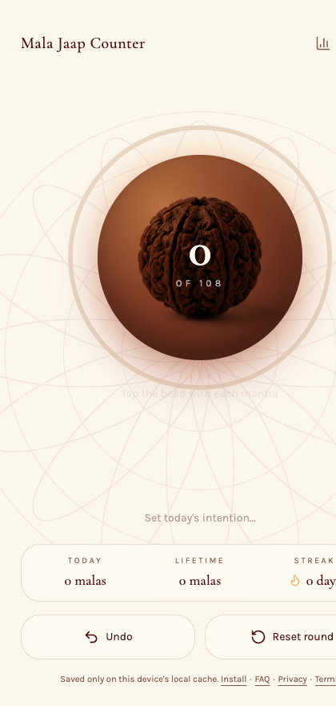
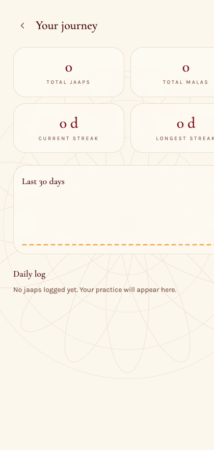
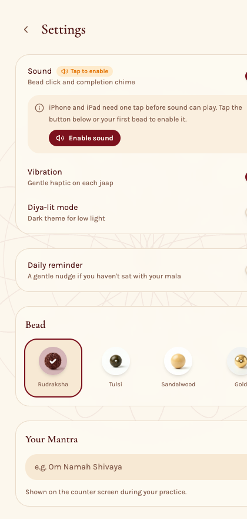
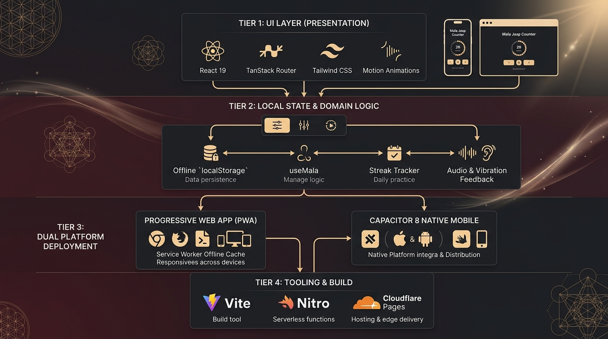
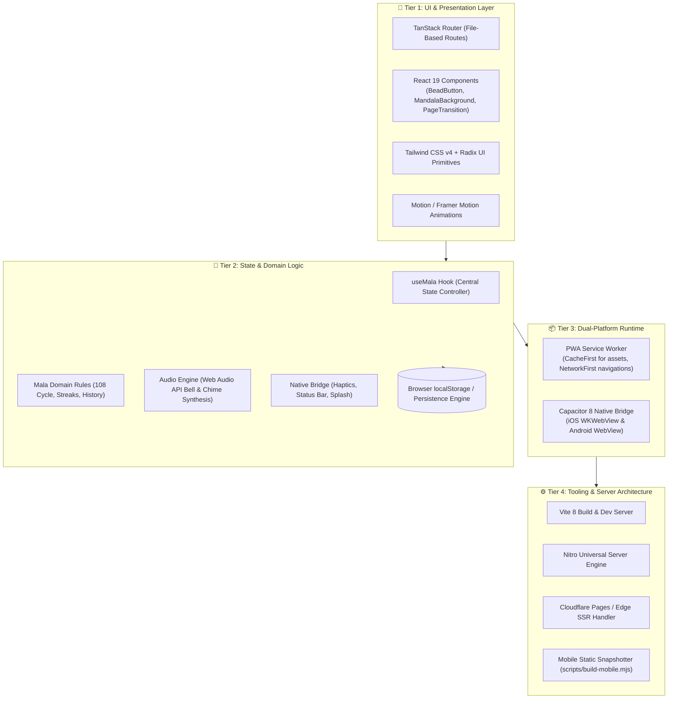

# 📿 Mala Jaap Counter

<div align="center">

**A calm, devotional, and completely offline digital mala bead counter.**  
Designed for mindful meditation and daily mantra practice with zero logins, zero servers, and full privacy.

[](https://react.dev/)
[](https://tanstack.com/start)
[](https://vitejs.dev/)
[](https://tailwindcss.com/)
[](https://capacitorjs.com/)
[](https://web.dev/progressive-web-apps/)
[](LICENSE)

</div>

---

## 📱 App Previews

<div align="center">
  <table>
    <tr>
      <td align="center" width="33%">
        <b>Sacred Counter Screen</b><br/><br/>
        
      </td>
      <td align="center" width="33%">
        <b>Stats & Daily Streaks</b><br/><br/>
        
      </td>
      <td align="center" width="33%">
        <b>Theme & Sound Settings</b><br/><br/>
        
      </td>
    </tr>
  </table>
</div>

---

## ✨ Features

- **Tactile Bead Interaction**: Tap the central sacred bead to increment counts. Supports gesture/button undo so accidental taps can be reversed without interrupting your rhythm.
- **Traditional Mala Logic**: Full 108-bead cycles (with options for 27, 54, or 1008 beads). Triggers an uplifting completion celebration with gentle chimes and haptic vibrations.
- **100% Offline & Private**: Zero user tracking, zero backend analytics, and zero external databases. All counts, history logs, and streaks reside exclusively in your device's `localStorage`.
- **Sensory Feedback**:
  - Web Audio API synthesized temple bells and mantra chimes (works without external sound asset latency).
  - Native haptic feedback via Capacitor Haptics on iOS/Android, with graceful fallback to the browser Vibration API.
- **Sacred Bead Themes**: Choose between authentic textures including **Rudraksha**, **Tulsi**, **Sandalwood**, and **Gold**.
- **Daily Practice Streaks & Journey History**: Visual tracking of current streak, longest streak, and day-by-day jaap volume.
- **Dual Platform Deployment**:
  - **PWA (Progressive Web App)**: Install directly from Safari or Chrome via "Add to Home Screen" with full service-worker offline caching.
  - **Native Mobile Apps (iOS & Android)**: Packaged with Capacitor 8 into production-ready Xcode and Android Studio projects.

---

## 🏛️ System Architecture

### Architectural Overview



### High-Level Component Flow



---

## 🔍 Detailed Architecture Breakdown

### 1. Presentation & UI Layer (`src/components`, `src/routes`)

- **Modern React 19 Architecture**: Utilizes React 19 hooks and functional components for snappy responsiveness.
- **File-Based Routing via TanStack Start**: Every screen is defined as a static, strongly-typed route under `src/routes/`:
  - `/` &rarr; Home counter with central bead button, progress ring, intention note, and undo/reset controls.
  - `/stats` &rarr; Lifetime totals, 30-day jaap volume charts, and daily streaks.
  - `/settings` &rarr; Bead theme picker, mala length presets, audio/vibration toggles, and daily reminders.
  - `/faq`, `/install`, `/privacy`, `/terms` &rarr; Informational and onboarding screens.
- **Sensory Animations with Motion**: Spring-physics tap-compression on the bead button, smooth SVG circular progress ring interpolations, screen transitions, and burst celebration on completing 108 beads.

### 2. State Management & Domain Logic (`src/hooks/useMala.ts`, `src/lib/mala.ts`)

- **Single Source of Truth**: The `useMala` hook manages all state changes through a pure state machine:
  - Bead counter ($0 \to 108$)
  - Lifetime mala completions
  - Total individual jaaps
  - Day-wise history map (`Record<YYYY-MM-DD, { malas, jaaps }>`)
  - Streak calculator (`currentStreak`, `longestStreak`, respecting day continuity)
- **Zero-Latency Audio Engine (`src/lib/feedback.ts`)**: Synthesizes warm bell tones and celebratory completion chimes using the browser's `AudioContext` with exponential gain decrescendos, avoiding network requests or audio file decodes.

### 3. Native & Platform Bridge (`src/lib/native.ts`, `src/lib/reminder.ts`)

- **Capacitor 8 Native Integration**:
  - `@capacitor/haptics`: Provides realistic mechanical feedback on physical devices (Light on bead count, Heavy vibration pattern on mala completion).
  - `@capacitor/status-bar` & `@capacitor/splash-screen`: Native window immersion matching the sacred maroon/gold color palette.
  - `@capacitor/local-notifications`: Schedules non-intrusive daily meditation reminders directly on the device.
- **Graceful Web Degradation**: Every native method contains automatic fallback logic so the app functions identically inside desktop and mobile browsers.

### 4. PWA Offline Engine (`src/lib/pwa.ts`, `vite.config.ts`)

- Configured with `vite-plugin-pwa` and Workbox:
  - **Static Assets**: Cached with `CacheFirst` strategies.
  - **Navigation Routes**: Handled via `NetworkFirst` with a 5-second timeout, falling back directly to cached pages when offline.
  - **Web Manifest**: Configured with maskable high-resolution icons for native home screen placement on iOS and Android.

### 5. Build Pipeline & Deployment Engine

- **Standard Vite + TanStack Start**:
  - Dev server runs directly via `vite dev` with hot module replacement (HMR).
  - Production build utilizes **Nitro** with preset `cloudflare-module` for edge SSR deployment on platforms like Cloudflare Pages.
  - Static snapshotting script (`scripts/build-mobile.mjs`) builds the app, spins up a local instance, generates pre-rendered HTML files for each screen into `dist/client`, and packages them for Capacitor native compilation.

---

## 🗂️ Project Directory Structure

```text
mala-spirit-counter/
├── docs/                           # Documentation assets
│   └── images/                     # Architecture diagrams & app screenshots
├── public/                         # Static assets (favicons, beads, og images, manifest)
│   ├── bead-gold.jpg               # Gold bead texture
│   ├── bead-rudraksha.jpg          # Rudraksha bead texture
│   ├── bead-sandalwood.jpg         # Sandalwood bead texture
│   ├── bead-tulsi.jpg              # Tulsi bead texture
│   └── manifest.webmanifest        # PWA Web Application Manifest
├── scripts/
│   └── build-mobile.mjs            # Static route snapshot generator for Capacitor
├── src/
│   ├── components/                 # Reusable UI components
│   │   ├── ui/                     # Accessible UI primitives (Radix UI + Tailwind)
│   │   ├── BeadButton.tsx          # 3D interactive bead with animated SVG progress ring
│   │   ├── MandalaBackground.tsx   # Sacred geometry SVG backdrop
│   │   ├── PageTransition.tsx      # Smooth screen cross-fade wrapper
│   │   └── ReminderWatcher.tsx     # Background notification checker
│   ├── hooks/
│   │   ├── useMala.ts              # Core state management hook
│   │   └── use-mobile.tsx          # Responsive viewport hook
│   ├── lib/
│   │   ├── feedback.ts             # Web Audio chime synthesis & haptic trigger
│   │   ├── mala.ts                 # Pure domain business logic & streak algorithms
│   │   ├── native.ts               # Capacitor native device bridge
│   │   ├── pwa.ts                  # Service worker lifecycle manager
│   │   ├── reminder.ts             # Local notification scheduler
│   │   ├── site.ts                 # Global site URL configuration
│   │   └── utils.ts                # Class merging and utility helpers
│   ├── routes/                     # TanStack Start file-based routing
│   │   ├── __root.tsx              # Application shell, head tags & provider tree
│   │   ├── index.tsx               # Main counter view (Home)
│   │   ├── stats.tsx               # Analytics & streak history screen
│   │   ├── settings.tsx            # Preferences, themes & audio configuration
│   │   ├── install.tsx             # Interactive PWA installation guide
│   │   ├── faq.tsx                 # Frequently asked questions
│   │   ├── privacy.tsx             # Privacy guarantee
│   │   ├── terms.tsx               # Usage terms
│   │   └── sitemap[.]xml.ts        # Dynamic XML sitemap generator
│   ├── router.tsx                  # TanStack Router instance factory
│   ├── server.ts                   # Nitro server fetch entry & SSR error boundary
│   └── styles.css                  # Tailwind CSS tokens, theme variables & utilities
├── capacitor.config.ts             # Native Capacitor bundle configuration
├── package.json                    # Project dependencies and npm scripts
├── tsconfig.json                   # TypeScript compiler configuration
└── vite.config.ts                  # Vite + TanStack Start + Nitro build setup
```

---

## 💾 Local Storage Data Schema

All persistent user data is stored in the browser `localStorage` under the key `mala_state_v1`:

```typescript
interface MalaData {
  count: number; // Current beads counted in active mala (0 to malaLength)
  totalMalas: number; // Lifetime completed malas
  totalJaaps: number; // Lifetime individual mantra repetitions
  intention: string; // User-defined intention or mantra name
  settings: {
    sound: boolean; // Audio chime toggle (default: true)
    vibration: boolean; // Haptic vibration toggle (default: true)
    beadTheme: "rudraksha" | "tulsi" | "sandalwood" | "gold";
    malaLength: number; // Beads per round: 27, 54, 108, or 1008 (default: 108)
    dailyTarget: number; // Target malas per day (default: 1)
    reminderTime: string; // Daily reminder in "HH:MM" format (default: "07:00")
    reminderEnabled: boolean; // Daily reminder enabled toggle
  };
  history: Record<
    string,
    {
      // Keyed by ISO date "YYYY-MM-DD"
      malas: number; // Malas finished on this day
      jaaps: number; // Total jaaps completed on this day
    }
  >;
}
```

---

## 🚀 Getting Started

### Prerequisites

- **Node.js**: v18.0.0 or higher
- **npm** or **bun**
- _(Optional for native mobile)_: **Xcode** for iOS / **Android Studio** for Android

### Installation

```bash
# Clone the repository
git clone https://github.com/NotSoToxic/mala-spirit-counter.git
cd mala-spirit-counter

# Install dependencies
npm install
```

### Local Development

Start the local dev server:

```bash
npm run dev
```

Open [http://localhost:5173](http://localhost:5173) in your browser.

### Quality Checks & Building

```bash
# Run ESLint check
npm run lint

# Format code with Prettier
npm run format

# Production web build (compiles client assets and Nitro server bundle)
npm run build

# Preview production build locally
npm run preview
```

---

## 📲 Native Mobile Builds (iOS & Android)

Mala Jaap Counter uses Capacitor to wrap the static web bundle inside native mobile shells:

### 1. One-time Setup

Add native platforms:

```bash
npx cap add ios       # Requires macOS and Xcode
npx cap add android   # Requires Android Studio & Android SDK
```

### 2. Build & Sync Workflow

Whenever you make changes to the app:

```bash
# 1. Generate the fully offline static bundle in dist/client
npm run build:mobile

# 2. Sync web bundle into native Xcode and Android Studio projects
npx cap sync
```

### 3. Open in IDEs for Emulation & Store Distribution

```bash
# Open Xcode project
npx cap open ios

# Open Android Studio project
npx cap open android
```

---

## 🔒 Privacy Guarantee

Mala Jaap Counter adheres to strict privacy principles:

- **No Analytics / Telemetry**: No tracking scripts, advertising trackers, or external third-party telemetry.
- **Device-Bound Data**: All mantra counts, streaks, and settings are stored locally on your device and are never transmitted over the internet.
- **Fully Offline**: All assets, scripts, and audio synthesis run without needing an internet connection.

---

## 📄 License

This project is licensed under the [MIT License](LICENSE).
